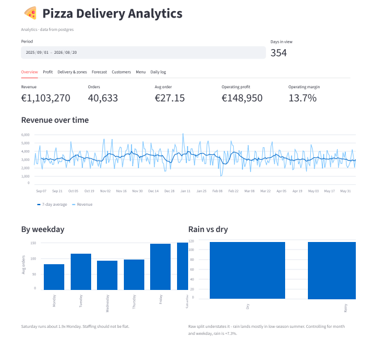
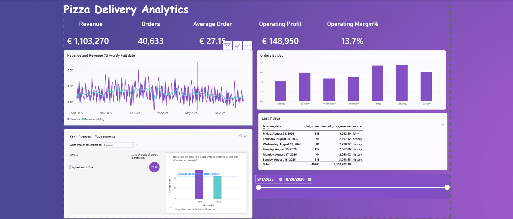
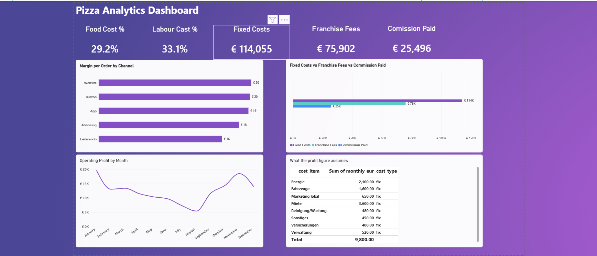

# Pizza Delivery Analytics

[](https://pizza-delivery-analytics.streamlit.app/)
[](https://pizza-daily-entry.streamlit.app/)
[](https://www.python.org/)
[](https://supabase.com/)
[](LICENSE)

End-to-end analytics for a single-branch pizza delivery business in Potsdam,
Germany — from a 90-second nightly form on a phone through to a live dashboard
and a Power BI report, refreshing itself every night with no one at a keyboard.

## Try it

| | |
|---|---|
| **[Dashboard →](https://pizza-delivery-analytics.streamlit.app/)** | Seven tabs: overview, profit, delivery zones, forecast, customers, menu, daily log. Reads live from Postgres. |
| **[Entry form →](https://pizza-daily-entry.streamlit.app/)** | What a shift lead fills in at close. Twelve fields, phone-first, about 90 seconds. Writes straight to the warehouse. |

Both run on Streamlit's free tier, so the first load after a quiet spell takes
a few seconds to wake. The form is live and writes to the database — the data
behind it is synthetic, so feel free to try it.

## What it looks like

**Streamlit dashboard** — reads live from Postgres, seven tabs



**Power BI — Overview.** Revenue against its 7-day average with anomaly
detection, orders by weekday, Key Influencers, and a live DirectQuery table of
the last seven days showing whether each figure came from the nightly form or
the order history.



**Power BI — Cost Stack.** Where the money goes. Margin per order by channel is
the one that matters: the aggregator returns €16 against €20 on the branch's
own website.



> **The data is synthetic.** Order history is generated, but driven by *real*
> Potsdam weather (Open-Meteo) and *real* Brandenburg public holidays, so the
> relationships the models find are grounded in genuine exogenous variation
> rather than noise. No real business, customer or financial data appears
> anywhere in this repository.

---

## The problem

A single delivery branch has no analytics. The till prints a daily total, the
aggregator sends a monthly statement, and nobody can answer the questions that
actually matter:

- Which delivery zones are worth serving?
- What does the aggregator really cost us per order?
- How many staff for next Friday?
- Are we making money, or just busy?

Anything built to answer these has to survive contact with a working kitchen:
whoever closes up at 23:30 is not going to open a laptop.

## What was built

```
  Entry form (phone)          ~90 seconds at close
        |
        v
  Supabase Postgres           staging -> star schema -> reporting marts
        |
        |  GitHub Actions, nightly 01:00
        |  rebuild marts + retrain models
        v
  +-------------------+-------------------+
  |                   |                   |
  Streamlit dashboard        Power BI report
  (live, 7 tabs)             (2 pages, composite model)
```

| Piece | What it does |
|---|---|
| `src/app.py` | Nightly entry form. 12 fields off the till receipt, phone-first. Refuses to run if it cannot save durably. |
| `src/dashboard.py` | Analytics dashboard — overview, profit, zones, forecast, customers, menu, daily log. |
| `sql/` | `staging` → `core` star schema (11 tables) → `mart` reporting layer. |
| `src/ml_*.py` | Five models: demand forecast, RFM, churn, delivery time, anomaly detection, market basket. |
| `.github/workflows/` | Nightly refresh. Rebuilds marts, retrains models, no local machine involved. |
| `dashboard/*.pbix` | Power BI report — Overview and Cost Stack. |

## What it found

Real findings from the modelled data, each pointing at a decision:

**The aggregator costs €3.79 per order.** Margin per order is €19.77 on the
branch's own website against €15.98 via the aggregator. Across the year that
gap is roughly €29,000 — an argument for pushing customers to the app.

**One delivery zone is structurally undeliverable.** Golm is 9.5 km out and
promised in 45 minutes; it misses that on 63% of orders. Distance drives 60% of
delivery time, so no amount of pushing staff fixes it. The model recommends a
55-minute promise there — and 35 minutes in the home zone, where the branch
currently under-promises by ten minutes.

**Labour is the only large cost that can be moved.** Of 86% of net revenue
consumed by costs, food, rent and franchise fees are contractual or
market-driven. Labour at 33% is the one an owner controls week to week.

**Demand is forecastable to 11% error.** Prophet with real weather forecasts
beats a same-day-last-week baseline by 32%, using the actual Open-Meteo outlook
for the coming fortnight.

## Stack

**Data** Supabase (Postgres 17) · star schema · dbt-style mart layer in plain SQL
**Pipeline** Python · pandas · SQLAlchemy · DuckDB for local runs
**ML** Prophet · scikit-learn · LightGBM · SHAP · mlxtend · statsmodels
**Apps** Streamlit (two apps, deployed on Community Cloud)
**BI** Power BI Desktop, composite model (Import + DirectQuery)
**Ops** GitHub Actions nightly refresh

## Running it

```bash
pip install -r requirements-ml.txt
```

Copy `.env.example` to `.env` and fill in your Postgres credentials, then:

```bash
python src/fetch_external.py    # real weather + holidays -> date dimension
```
```bash
python src/generate_data.py     # build the synthetic warehouse
```
```bash
python src/validate_data.py     # quality gate
```
```bash
python src/load_to_postgres.py  # deploy schema, bulk COPY
```
```bash
python src/build_marts.py       # reporting layer
```
```bash
python src/run_ml.py            # five models -> seven mart tables
```

Then either app:

```bash
streamlit run src/dashboard.py
```
```bash
streamlit run src/app.py
```

To work entirely offline, skip the Postgres steps and use
`python src/build_marts.py --local` — everything falls back to Parquet.

## Documentation

| | |
|---|---|
| `docs/supabase_setup.md` | Creating the database and connecting to it |
| `docs/deploy_streamlit.md` | Deploying both apps, and the nightly workflow |
| `docs/powerbi_setup.md` | Connecting Power BI, the model, refresh |
| `docs/data_dictionary.md` | Every table and column |

## Design decisions worth knowing

**The mart layer is the contract.** Power BI and Streamlit read `mart.*` and
nothing else, so the model underneath can be reshaped without breaking a
report.

**Costs are data, not code.** Every P&L assumption lives in
`src/reference_data.py` and is loaded into `mart.dim_cost_assumption`, so the
report can show what a profit figure rests on instead of asserting it.

**The form fails loudly.** On a host with no durable storage it refuses to
render rather than accepting entries it would silently lose — the worst failure
mode for a data-capture app.

**Models are trained locally, served from the database.** The Streamlit apps
never import Prophet or LightGBM; they read model *output* from mart tables.
Deploys stay small and fast.

## Known limitations

- **One year of history.** Rain and heat effects are statistically
  identifiable; cold, public-holiday and school-holiday effects are not — 354
  days contains only 12 public holidays. `validate_data.py` reports this on
  every run. Extending the range in `fetch_external.py` resolves it.
- **Brandenburg school-holiday dates are approximations**, not official MBJS
  dates.
- **The cost model is estimated**, not taken from any real set of books.
  Replace the figures in `src/reference_data.py` before they inform a decision.
- **Power BI connects with encryption disabled.** Supabase signs its pooler
  certificate with a private CA that Windows does not trust. Acceptable for
  synthetic data; install the Supabase CA before anything real.
